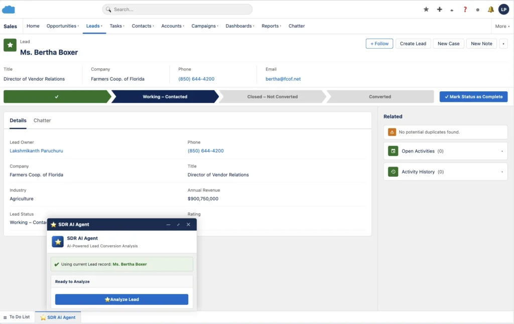
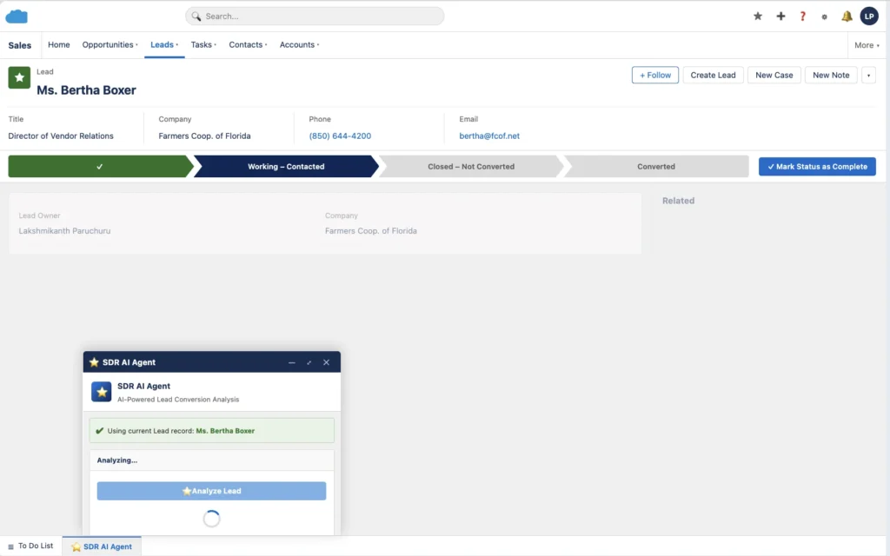
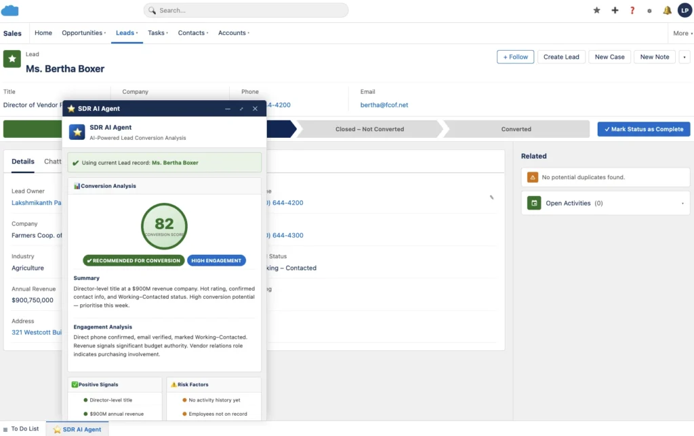
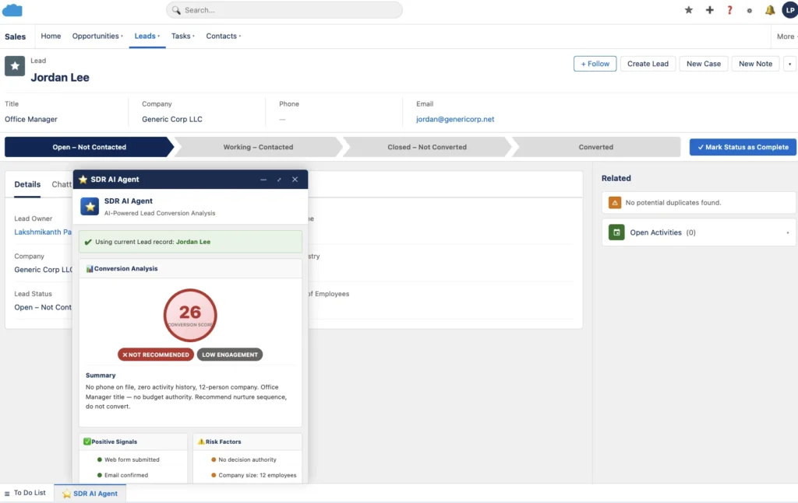

# SDR AI Lead Agent

A Salesforce utility-bar agent that tells SDRs **which lead to chase**. Open a Lead, click **Analyze Lead**, and Claude returns a conversion score (0–100), YES / NO / MAYBE, signals, and next steps — without leaving the CRM.

This repo is the working metadata from the walkthrough:

**[Build an AI agent inside Salesforce that tells SDRs which lead to chase](https://www.apexhours.com/build-an-ai-agent-inside-salesforce-that-tells-sdrs-which-lead-to-chase/)** — Apex Hours, Lakshmikanth Paruchuru

> **Never commit a real Anthropic key.** Every credential file in this repo uses the placeholder `<Your API Key>`.

---

## What it looks like

**1 — Open SDR AI Agent from the Sales utility bar.** The panel detects the Lead you are viewing.



**2 — Click Analyze Lead.** Claude reads the Lead plus tasks, events, and emails (~10 seconds).



**3 — High-intent lead.** Score, recommendation, signals, and next steps.



**4 — Low-intent lead.** Not recommended — nurture instead of convert.



---

## Architecture

```
SDR clicks "Analyze Lead"
        │
        ▼
  LWC: sdrAgentUtility
  (Utility Bar / Record Page)
        │  @AuraEnabled
        ▼
  Apex: LeadAnalysisService
  (Lead + Tasks + Events + Emails)
        │  structured prompt
        ▼
  Apex: ClaudeAPIService
        │  Named Credential Claude_API
        ▼
  https://api.anthropic.com/v1/messages
        │
        ▼
  Score · YES/NO/MAYBE · Signals · Next Steps
```

| Metadata | API name | Role |
| --- | --- | --- |
| LWC | `sdrAgentUtility` | Utility bar / record-page UI |
| Apex | `LeadAnalysisService` | Gathers Lead history, builds prompt, parses JSON |
| Apex | `ClaudeAPIService` | HTTP callout to Claude Messages API |
| Named Credential | `Claude_API` | `https://api.anthropic.com` |
| External Credential | `Claude_API_Credential` | Custom auth, header `x-api-key`, principal `Claude_Principal` |
| External Credential | `Claude_API_Auth` | Optional leftover principal (`SDR Agent`) — not referenced by the Named Credential |
| FlexiPage | `LightningSales_UtilityBar` | Sales app utility bar with the LWC |
| Permission Set | `SDR_AI_Agent` | Apex class access + External Credential Principal |

---

## Prerequisites

1. [Salesforce CLI](https://developer.salesforce.com/tools/salesforcecli)
2. A Salesforce org (Developer Edition is enough)
3. An Anthropic API key from [platform.claude.com](https://platform.claude.com/) → **Settings → API Keys → Create Key**
   - Copy it immediately. Anthropic shows it once.
   - It looks like `sk-ant-api03-...`
   - In this project you will paste it as **`<Your API Key>`** in Setup — never into git.

---

## Setup

### 1. Clone and authorize an org

```bash
git clone https://github.com/Lakshmikanth-Paruchuru/sdr-ai-lead-agent.git
cd sdr-ai-lead-agent

sf org login web --alias sdr-agent
```

### 2. Deploy the sample (no secret yet)

Deploy Apex, LWC, Named Credential, External Credentials, utility bar, and the permission set.

```bash
sf project deploy start --target-org sdr-agent \
  --source-dir force-app/main/default
```

The External Credential XML ships with:

```xml
<parameterValue>&lt;Your API Key&gt;</parameterValue>
```

That is a **placeholder**. The callout will fail until you replace it in Setup.

### 3. Paste `<Your API Key>` in Salesforce

1. **Setup → Named Credentials → External Credentials**
2. Open **Claude API Credential** (`Claude_API_Credential`)
3. Related list **Custom Headers** → edit **`x-api-key`**
4. Set **Value** to your real key from platform.claude.com  
   (the same place this repo documents as `<Your API Key>`)
5. Save

Confirm **Named Credentials → Claude API** (`Claude_API`):

| Field | Value |
| --- | --- |
| URL | `https://api.anthropic.com` |
| External Credential | `Claude_API_Credential` |
| Generate Authorization Header | Unchecked |

Apex calls `callout:Claude_API/v1/messages`. Do not hardcode the key in Apex.

If you prefer to create credentials by hand instead of deploying the XML, use the tables in [Manual credential setup](#manual-credential-setup).

### 4. Grant External Credential Principal access

This is the step that is usually missed. Without it you get **Callout not authorized**.

1. **Setup → Permission Sets → SDR AI Agent**
2. **Manage Assignments** → assign it to your user
3. Confirm **External Credential Principal Access** includes  
   **Claude_API_Credential – Claude_Principal**

If you use your own permission set instead:

1. Open that permission set
2. **External Credential Principal Access → Edit**
3. Enable **Claude_API_Credential – Claude_Principal**
4. Assign the permission set to SDR users

### 5. Add the LWC to the utility bar (if the Sales app did not pick it up)

The retrieved `LightningSales_UtilityBar` FlexiPage already includes `sdrAgentUtility`. If your org’s Sales app does not show it:

1. **Setup → App Manager → Sales → Edit**
2. **Utility Items (Desktop Only) → Add Utility Item**
3. Search **SDR AI Agent**
4. Panel height **600**, icon **einstein**
5. Save

Optional: on a Lead record, **Setup gear → Edit Page**, drag **SDR AI Agent** onto the layout, Save + Activate.

### 6. Smoke-test the Claude callout

Developer Console → **Debug → Open Execute Anonymous Window**, or:

```bash
sf apex run --file scripts/apex/testClaudeConnection.apex --target-org sdr-agent
```

| Debug line | Meaning |
| --- | --- |
| `SUCCESS! Response: SUCCESS` | Credentials and Principal access work |
| `Callout not authorized` | Assign **SDR AI Agent** (or grant Principal access) |
| `401` / `Unauthorized` | The `x-api-key` value is still `<Your API Key>` or the key is wrong |

### 7. Run it on a Lead

1. Open the **Sales** app
2. Open any Lead (more activity = better analysis)
3. Click **SDR AI Agent** in the utility bar
4. Confirm the Lead is selected (auto-detected on a Lead page)
5. Click **Analyze Lead**

---

## Manual credential setup

Use this if you do not deploy the External / Named Credential XML.

### External Credential

| Field | Value |
| --- | --- |
| Label | Claude API Credential |
| Name | `Claude_API_Credential` |
| Authentication Protocol | **Custom** |

**Principal**

| Field | Value |
| --- | --- |
| Principal Name | `Claude_Principal` |
| Identity Type | Named Principal |
| Sequence | 1 |

**Custom Header**

| Field | Value |
| --- | --- |
| Name | `x-api-key` |
| Value | `<Your API Key>` |
| Sequence | 1 |

### Named Credential

| Field | Value |
| --- | --- |
| Label | Claude API |
| Name | `Claude_API` |
| URL | `https://api.anthropic.com` |
| External Credential | `Claude_API_Credential` |
| Generate Authorization Header | Unchecked |
| Allow Merge Fields in Body | Unchecked |

---

## What’s in the prompt

`LeadAnalysisService` sends Claude:

- Lead fields (name, company, title, industry, status, rating, source, employees, revenue, description)
- Up to 50 Tasks and 25 Events
- Up to 30 EmailMessage rows matched on the Lead’s email (500-character body preview)

Claude must reply as JSON: `conversionScore`, `recommendation`, `positiveSignals`, `negativeSignals`, `engagementLevel`, `engagementAnalysis`, `nextSteps`, `riskFactors`, `summary`.

The LWC renders that JSON. Treat the score as a recommendation, not a convert button.

---

## Troubleshooting

| Symptom | Fix |
| --- | --- |
| Analyze does nothing / Apex error | Confirm `ClaudeAPIService` and `LeadAnalysisService` deployed |
| `Callout not authorized` | Permission Set **External Credential Principal Access** |
| HTTP 401 | Replace `<Your API Key>` on the External Credential header |
| HTTP 404 on `/v1/messages` | Named Credential URL must be `https://api.anthropic.com` (no path) |
| Component missing in App Builder | Deploy `sdrAgentUtility`; targets include Utility Bar + Record Page |
| Sparse / low scores | Expected when the Lead has little activity |

Model used in Apex: `claude-sonnet-4-5-20250929`. Timeout is 120 seconds.

---

## Security

- Store the key only in the External Credential Custom Header.
- Do not put `sk-ant-...` in Apex, LWC, README, or git.
- Rotate any key that was ever retrieved into source or a chat log.
- Do not wire `analyzeLead` to a trigger or batch that fans out thousands of callouts.

---

## License

Sample code for learning and reuse. Walkthrough: [Apex Hours article](https://www.apexhours.com/build-an-ai-agent-inside-salesforce-that-tells-sdrs-which-lead-to-chase/).
